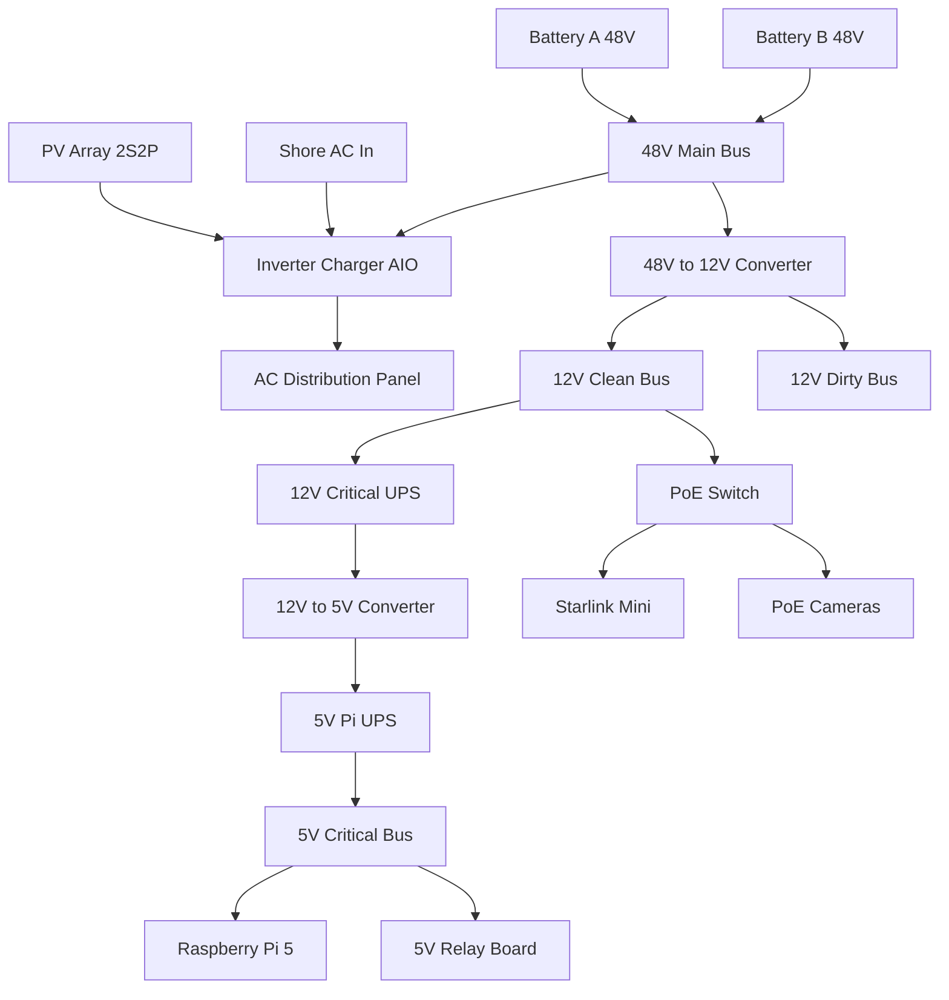

# Power Flow Overview

This file is intentionally text-first so it stays easy to diff in Git.

## High-level power path

## Intentional modeling choices
- `BUS_12V_CLEAN` and `BUS_12V_DIRTY` are modeled separately now so you can enforce cleaner power paths later.
- The Raspberry Pi is modeled behind both a 12V critical UPS stage and a 5V UPS stage because you have emphasized uptime and power stability.
- AC, PV, and telemetry are all present in the same project, but can be broken into separate diagrams once the layout stabilizes.

## Suggested next split
Create separate diagram files for:
- `01_overview.drawio`
- `02_48v_power.drawio`
- `03_12v_distribution.drawio`
- `04_5v_critical.drawio`
- `05_ac_distribution.drawio`
- `06_telemetry.drawio`
